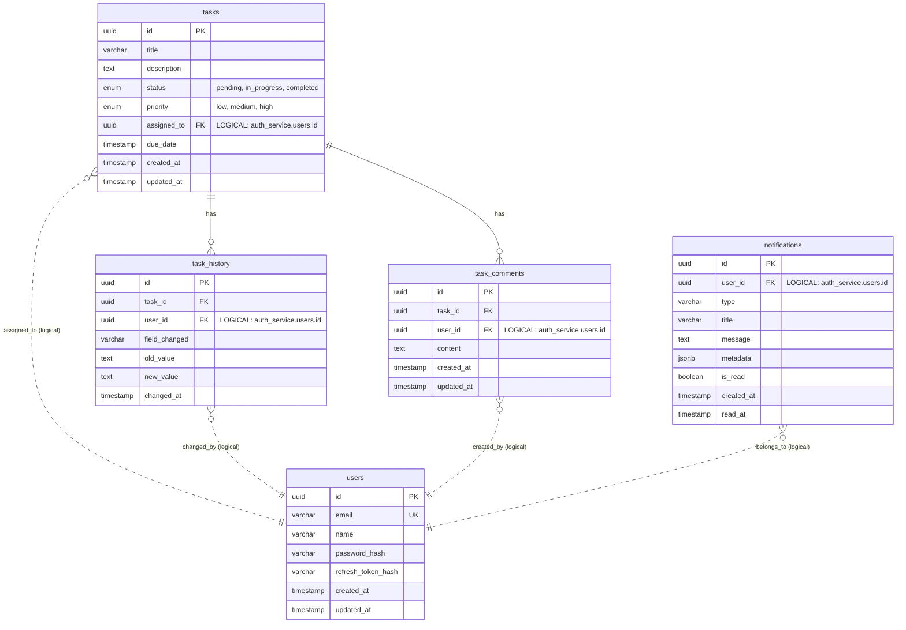

# Fullstack Challenge - Sistema de Gerenciamento de Tarefas

## 📐 Arquitetura


### Fluxo de Dados

1. **Requisições Síncronas (TCP)**: Frontend → Gateway → Auth/Task Services
2. **Eventos Assíncronos (RabbitMQ)**: Task Service → Queue → Notification Service

---



## 📊 Detalhes dos Schemas

### 🔐 auth_service (Auth Service)

- **users**: Armazena credenciais e tokens de autenticação
  - `password_hash`: Senha criptografada com bcrypt
  - `refresh_token_hash`: Token hash para renovação de sessão
  - `email`: Único (constraint)
  - `username`: Único (constraint)

### 📋 task_service (Task Service)

- **tasks**: Entidade principal de tarefas
  - `status`: ENUM (pending | in_progress | completed)
  - `priority`: ENUM (low | medium | high)
  - `assigned_to`: FK para users (cross-schema reference)

- **task_history**: Auditoria de alterações
  - Registra quem mudou, qual campo e valores antigo/novo

- **task_comments**: Sistema de comentários
  - Referências cross-schema para users

### 🔔 notification_service (Notification Service)

- **notifications**: Notificações assíncronas
  - `metadata`: JSONB para dados flexíveis do evento
  - `is_read`: Flag de leitura
  - `user_id`: FK cross-schema para users

## 🔗 Cross-Schema References

> **Nota**: Embora os schemas sejam isolados, as FKs para `users` são **referências lógicas** (via UUID). O TypeORM não cria constraints físicas entre schemas diferentes, mantendo o desacoplamento dos microsserviços pois seriam banco de dados separados.

---

## 🧠 Decisões Técnicas e Trade-offs

### 1. Arquitetura de Comunicação Híbrida (TCP + RabbitMQ)

**Decisão**: Não usei apenas um protocolo de comunicação.

- **Gateway ↔ Auth/Tasks**: TCP (Síncrono/RPC)
- **Tasks ➝ Notifications**: RabbitMQ (Assíncrono/Eventos)

**Justificativa**:
Decidi usar uma abordagem híbrida para priorizar a **Experiência do Usuário (UX)**. Para operações como login e listagem de tarefas, o usuário está esperando na tela, então usei TCP que é mais rápido e direto (sem overhead de HTTP). Já para as notificações, que são efeitos colaterais e não podem travar o fluxo principal, usei RabbitMQ para garantir desacoplamento e resiliência.

**Trade-offs**:

- ✅ Melhor performance em operações críticas
- ✅ Resiliência em operações assíncronas
- ❌ Maior complexidade de infraestrutura (2 tipos de comunicação)

---

### 2. Isolação de Dados via Schemas do PostgreSQL

**Decisão**: Usei um único container de banco de dados, mas criei schemas diferentes (`auth_service`, `task_service`, `notification_service`) para cada microsserviço.

**Justificativa**:
Embora a teoria pura de microsserviços diga "um banco por serviço", manter 3 instâncias de Postgres rodando localmente consumiria muita memória e complicaria a infraestrutura do teste. O uso de Schemas me deu o **isolamento lógico** necessário (um serviço não acessa a tabela do outro) com a simplicidade operacional de gerenciar apenas uma instância de banco.

**Trade-offs**:

- ✅ Menor consumo de recursos (RAM/CPU)
- ✅ Setup mais simples
- ✅ Isolamento lógico mantido
- ❌ Possível ponto único de falha (em produção, seria separado)

---

### 3. Orquestração de Startup e Health Checks (Docker)

**Decisão**: Configurei `healthcheck` no Postgres e RabbitMQ, e usei `depends_on: service_healthy` nos microsserviços. Também coloquei a execução das Migrations no comando de startup.

**Justificativa**:
Queria uma experiência de **"Zero Configuração"** para quem for rodar o projeto. Resolvi o problema clássico de **Race Condition** (onde a app tenta conectar antes do banco estar pronto) garantindo que o Docker só inicie a aplicação quando a infraestrutura estiver saudável. As migrations automáticas garantem que o banco esteja sempre na versão correta do código.

**Trade-offs**:

- ✅ Setup automático (`docker-compose up` e pronto)
- ✅ Zero race conditions
- ✅ Migrations sempre aplicadas
- ❌ Startup inicial um pouco mais lento (aguarda health checks)

---

## ⚠️ Problemas Conhecidos e Melhorias Futuras

### Problemas Conhecidos

1. **Sem retry policy nas filas**: Se o Notification Service falhar ao processar uma mensagem, ela é perdida
2. **Autenticação básica**: JWT stateless (dificulta revogação imediata)

### O que Melhoraria com Mais Tempo

- [ ] **Gestão de Sessão com Redis**: Implementar controle de sessão para mitigar _Race Conditions_ e _Replay Attacks_, além de permitir _Blacklist_ para revogação de tokens.
- [ ] Implementar Circuit Breaker pattern nas comunicações TCP
- [ ] Adicionar observabilidade (Prometheus + Grafana)
- [ ] Implementar testes E2E com Cypress
- [ ] Cache com Redis para listagem de tarefas
- [ ] Dead Letter Queue (DLQ) no RabbitMQ
- [ ] CI/CD com GitHub Actions
- [ ] Documentação Swagger/OpenAPI completa

---

## ⏱️ Tempo Gasto (WakaTime Data)

O desenvolvimento totalizou **49 horas**, com foco intensivo na robustez da infraestrutura e na lógica de sincronização entre os serviços.

| Área de Desenvolvimento        | Tempo Real  |                                 |
| :----------------------------- | :---------- | :------------------------------ |
| **Frontend (React + UI)**      | 16h 30m     |
| **Infraestrutura (Docker)**    | 7h 00m      |
| **Task Service (Core Logic)**  | 8h 15m      |
| **Auth Service & Gateway**     | 6h 30m      |
| **Notification Service (RMQ)** | 4h 30m      |
| **Refatoração & Testes**       | 4h 20m      |
| **Documentação & Setup**       | 2h 00m      |
| **TOTAL GERAL**                | **49h 05m** | **Dados extraídos do WakaTime** |

---

## 📂 Estrutura do Projeto

O projeto utiliza **Turborepo** para gerenciamento do monorepo:

```bash
fullstack-challenge
├── apps/                               # 📦 Aplicações e Serviços
│   ├── api-gateway/                    # Entrypoint HTTP (NestJS)
│   │   ├── src/common/filters/         # Filtros para converter erros RPC -> HTTP
│   │   └── src/[modules]/              # Controllers que roteiam para os microsserviços
│   │
│   ├── auth-service/                   # Microsserviço de Autenticação (TCP)
│   │   ├── db/migrations/              # Migrations exclusivas do schema 'auth_service'
│   │   └── src/auth/                   # Lógica de JWT e Hash de Senha
│   │
│   ├── tasks-service/                  # Microsserviço Core (Híbrido: TCP + RabbitMQ)
│   │   ├── db/migrations/              # Migrations do schema 'task_service'
│   │   ├── src/history/                # Lógica de Auditoria (Audit Log)
│   │   └── src/task/                   # CRUD e Publicação de Eventos
│   │
│   ├── notifications-service/          # Microsserviço de Notificações (RabbitMQ Consumer)
│   │   ├── src/notifications.gateway.ts # WebSocket Gateway (Socket.io)
│   │   └── src/notifications/          # Consumo de filas e disparo de eventos
│   │
│   └── web/                            # Frontend (React + Vite + TanStack)
│       ├── src/components/ui/          # Componentes Shadcn/UI
│       ├── src/hooks/                  # Custom Hooks (React Query + WebSocket)
│       ├── src/services/               # Camada de API (Axios)
│       └── src/pages/                  # Rotas da aplicação (Kanban, Login)
│
├── packages/                           # 🛠️ Bibliotecas Compartilhadas (Shared Libs)
│   ├── types/                          # 'Source of Truth': DTOs, Enums e Interfaces
│   │   ├── dto/                        # Objetos de transferência de dados
│   │   └── payloads/                   # Payloads de eventos RabbitMQ/JWT
│   ├── exceptions/                     # Padronização de erros entre serviços
│   └── eslint-config/                  # Regras de Linting compartilhadas
│
├── scripts/
│   └── seed.ts                         # Script para popular o banco de dados
│
├── docker-compose.yml                  # Orquestração da Infraestrutura
└── turbo.json                          # Pipeline de Build do Monorepo
```

---

## 🚀 Como Executar

### Pré-requisitos

- Docker & Docker Compose
- Node.js 18+ (para desenvolvimento local)

### Rodar o Projeto

```bash
# Clonar o repositório
git clone <repository-url>
cd fullstack-challenge

# Subir toda a infraestrutura
docker compose up -d --build

# Acessar a aplicação
# Frontend: http://localhost:5173
# RabbitMQ Management: http://localhost:15672 (guest/guest)
```

---

## 🔧 Variáveis de Ambiente

Todas as variáveis estão no `docker-compose.yml` para facilitar o teste. Em produção, usar `.env` e secrets.

---

## 📚 Stack Tecnológica

- **Backend**: NestJS, TypeScript, TypeORM
- **Frontend**: React, Vite, TailwindCSS
- **Banco de Dados**: PostgreSQL
- **Message Broker**: RabbitMQ
- **Containerização**: Docker, Docker Compose
- **Testes**: Jest (Backend)

### 🌱 Populando o Banco de Dados

Para testar o projeto com dados reais, execute o script de seed (com os containers rodando):

```bash
# Instala dependências do script (caso necessário)
npm install

# Executa o seed
npm run seed
```

---

### 📖 Documentação da API

Após subir os containers, a documentação interativa (Swagger/OpenAPI) estará disponível em:

👉 **[http://localhost:3001/api/docs](http://localhost:3001/api/docs)**

---

## 🔧 Troubleshooting (Resolução de Problemas)

**1. Erro: "Port already in use"**
Garanta que as portas `3000`, `3001`, `5432` e `5672` estejam livres.

```bash
docker compose down -v
```
