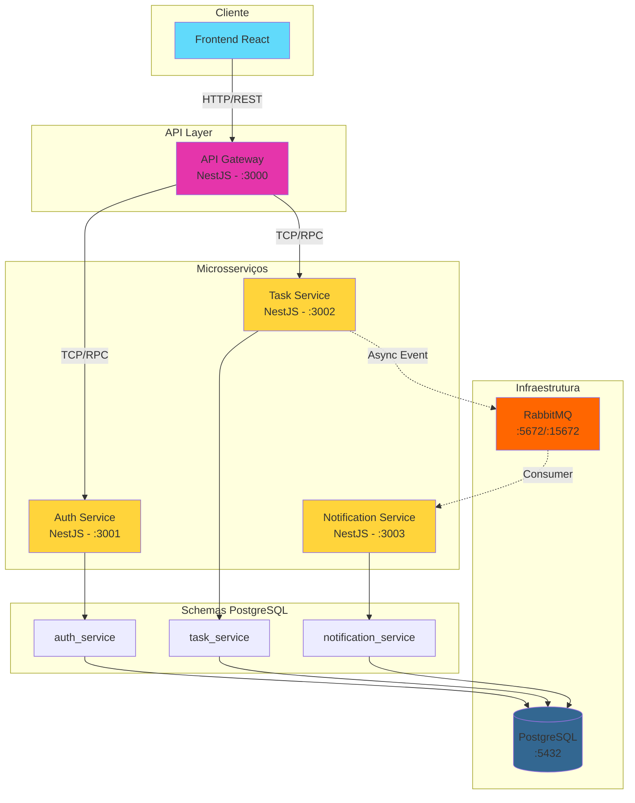

# Fullstack Challenge - Sistema de Gerenciamento de Tarefas

## 📐 Arquitetura


```mermaid
graph TB
    subgraph "Cliente"
        FE[Frontend React]
    end

    subgraph "API Layer"
        GW[API Gateway<br/>NestJS - :3000]
    end

    subgraph "Microsserviços"
        AUTH[Auth Service<br/>NestJS - :3001]
        TASK[Task Service<br/>NestJS - :3002]
        NOTIF[Notification Service<br/>NestJS - :3003]
    end

    subgraph "Infraestrutura"
        PG[(PostgreSQL<br/>:5432)]
        RMQ[RabbitMQ<br/>:5672/:15672]
    end

    subgraph "Schemas PostgreSQL"
        AUTH_SCHEMA[auth_service]
        TASK_SCHEMA[task_service]
        NOTIF_SCHEMA[notification_service]
    end

    FE -->|HTTP/REST| GW
    GW -->|TCP/RPC| AUTH
    GW -->|TCP/RPC| TASK

    TASK -.->|Async Event| RMQ
    RMQ -.->|Consumer| NOTIF

    AUTH --> AUTH_SCHEMA
    TASK --> TASK_SCHEMA
    NOTIF --> NOTIF_SCHEMA

    AUTH_SCHEMA --> PG
    TASK_SCHEMA --> PG
    NOTIF_SCHEMA --> PG

    style FE fill:#61dafb
    style GW fill:#e535ab
    style AUTH fill:#ffd43b
    style TASK fill:#ffd43b
    style NOTIF fill:#ffd43b
    style PG fill:#336791
    style RMQ fill:#ff6600
```

### Fluxo de Dados

1. **Requisições Síncronas (TCP)**: Frontend → Gateway → Auth/Task Services
2. **Eventos Assíncronos (RabbitMQ)**: Task Service → Queue → Notification Service

---

## 🧠 Decisões Técnicas e Trade-offs

### 1. Arquitetura de Comunicação Híbrida (TCP + RabbitMQ)

**Decisão**: Não usei apenas um protocolo de comunicação.

- **Gateway ↔ Auth/Tasks**: TCP (Síncrono/RPC)
- **Tasks ➝ Notifications**: RabbitMQ (Assíncrono/Eventos)

**Justificativa**:
Decidi usar uma abordagem híbrida para priorizar a **Experiência do Usuário (UX)**. Para operações como login e listagem de tarefas, o usuário está esperando na tela, então usei TCP que é mais rápido e direto (sem overhead de HTTP). Já para as notificações, que são efeitos colaterais e não podem travar o fluxo principal, usei RabbitMQ para garantir desacoplamento e resiliência.

**Trade-offs**:

- ✅ Melhor performance em operações críticas
- ✅ Resiliência em operações assíncronas
- ❌ Maior complexidade de infraestrutura (2 tipos de comunicação)

---

### 2. Isolação de Dados via Schemas do PostgreSQL

**Decisão**: Usei um único container de banco de dados, mas criei schemas diferentes (`auth_service`, `task_service`, `notification_service`) para cada microsserviço.

**Justificativa**:
Embora a teoria pura de microsserviços diga "um banco por serviço", manter 3 instâncias de Postgres rodando localmente consumiria muita memória e complicaria a infraestrutura do teste. O uso de Schemas me deu o **isolamento lógico** necessário (um serviço não acessa a tabela do outro) com a simplicidade operacional de gerenciar apenas uma instância de banco.

**Trade-offs**:

- ✅ Menor consumo de recursos (RAM/CPU)
- ✅ Setup mais simples
- ✅ Isolamento lógico mantido
- ❌ Possível ponto único de falha (em produção, seria separado)

---

### 3. Orquestração de Startup e Health Checks (Docker)

**Decisão**: Configurei `healthcheck` no Postgres e RabbitMQ, e usei `depends_on: service_healthy` nos microsserviços. Também coloquei a execução das Migrations no comando de startup.

**Justificativa**:
Queria uma experiência de **"Zero Configuração"** para quem for rodar o projeto. Resolvi o problema clássico de **Race Condition** (onde a app tenta conectar antes do banco estar pronto) garantindo que o Docker só inicie a aplicação quando a infraestrutura estiver saudável. As migrations automáticas garantem que o banco esteja sempre na versão correta do código.

**Trade-offs**:

- ✅ Setup automático (`docker-compose up` e pronto)
- ✅ Zero race conditions
- ✅ Migrations sempre aplicadas
- ❌ Startup inicial um pouco mais lento (aguarda health checks)

---

## ⚠️ Problemas Conhecidos e Melhorias Futuras

### Problemas Conhecidos

1. **Sem retry policy nas filas**: Se o Notification Service falhar ao processar uma mensagem, ela é perdida
2. **Autenticação básica**: JWT stateless (dificulta revogação imediata)

### O que Melhoraria com Mais Tempo

- [ ] **Gestão de Sessão com Redis**: Implementar controle de sessão para mitigar _Race Conditions_ e _Replay Attacks_, além de permitir _Blacklist_ para revogação de tokens.
- [ ] Implementar Circuit Breaker pattern nas comunicações TCP
- [ ] Adicionar observabilidade (Prometheus + Grafana)
- [ ] Implementar testes E2E com Cypress
- [ ] Cache com Redis para listagem de tarefas
- [ ] Dead Letter Queue (DLQ) no RabbitMQ
- [ ] CI/CD com GitHub Actions
- [ ] Documentação Swagger/OpenAPI completa

---

## ⏱️ Tempo Gasto (WakaTime Data)

O desenvolvimento totalizou **49 horas**, com foco intensivo na robustez da infraestrutura e na lógica de sincronização entre os serviços.

| Área de Desenvolvimento        | Tempo Real  | Destaques do WakaTime                                   |
| :----------------------------- | :---------- | :------------------------------------------------------ |
| **Frontend (React + UI)**      | 16h 30m     | `TaskDetailDialog.tsx` (2h 35m), `KanbanBoard.tsx`      |
| **Infraestrutura (Docker)**    | 7h 00m      | `docker-compose.yml` (2h 54m), Healthchecks e Tunelling |
| **Task Service (Core Logic)**  | 8h 15m      | `task.service.ts` (3h 27m), Histórico e Auditoria       |
| **Auth Service & Gateway**     | 6h 30m      | `auth.service.ts` (1h 36m), JWT Strategy, TCP Transport |
| **Notification Service (RMQ)** | 4h 30m      | `notifications.gateway.ts`, Consumo de filas            |
| **Refatoração & Testes**       | 4h 20m      | Ajustes de arquitetura (Mudança RMQ -> TCP)             |
| **Documentação & Setup**       | 2h 00m      | `README.md`, Diagramas e Configurações iniciais         |
| **TOTAL GERAL**                | **49h 05m** | **Dados extraídos do WakaTime**                         |

---

## 🚀 Como Executar

### Pré-requisitos

- Docker & Docker Compose
- Node.js 18+ (para desenvolvimento local)

### Rodar o Projeto

```bash
# Clonar o repositório
git clone <repository-url>
cd fullstack-challenge

# Subir toda a infraestrutura
docker compose up -d --build

# Acessar a aplicação
# Frontend: http://localhost:5173
# RabbitMQ Management: http://localhost:15672 (guest/guest)
```

---

## 🔧 Variáveis de Ambiente

Todas as variáveis estão no `docker-compose.yml` para facilitar o teste. Em produção, usar `.env` e secrets.

---

## 📚 Stack Tecnológica

- **Backend**: NestJS, TypeScript, TypeORM
- **Frontend**: React, Vite, TailwindCSS
- **Banco de Dados**: PostgreSQL
- **Message Broker**: RabbitMQ
- **Containerização**: Docker, Docker Compose
- **Testes**: Jest (Backend)
